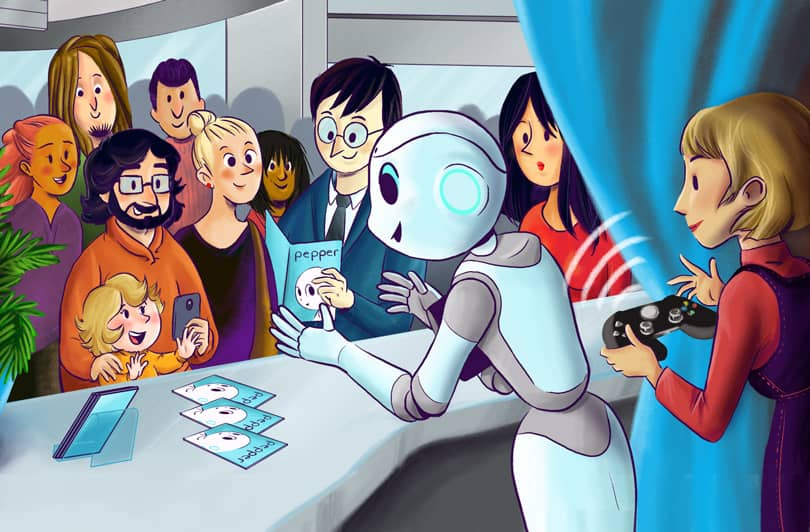
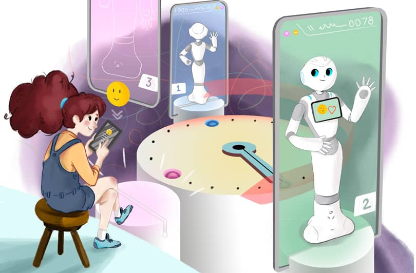
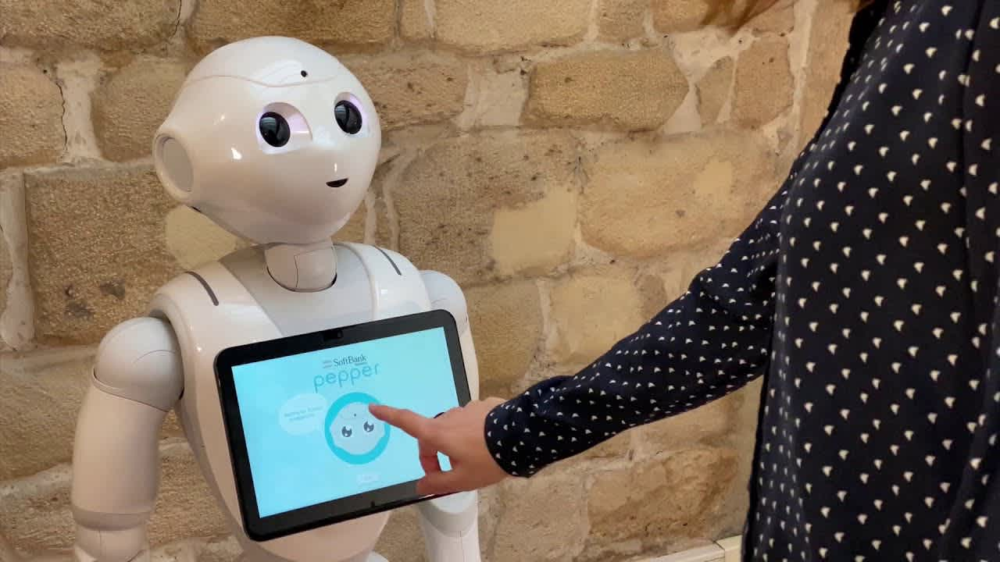
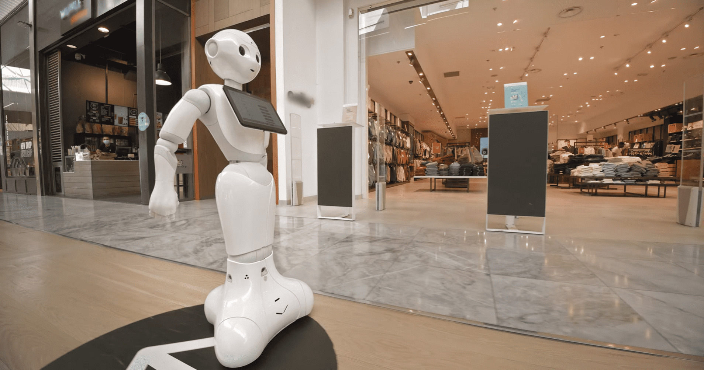
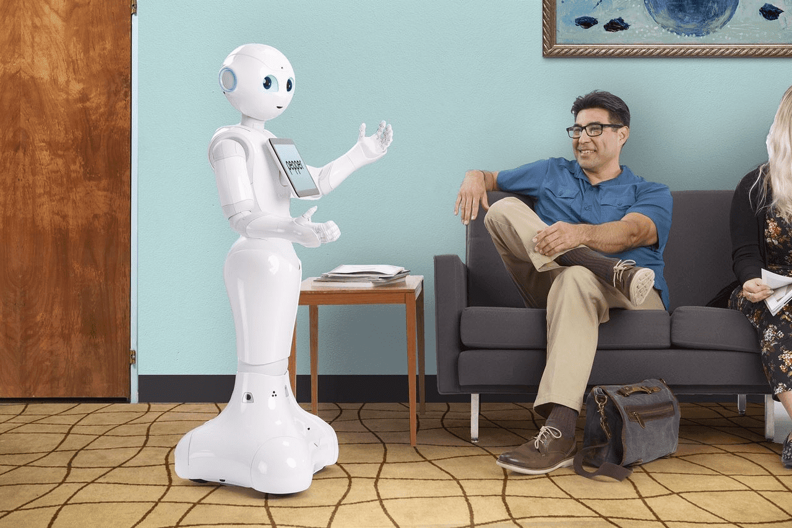
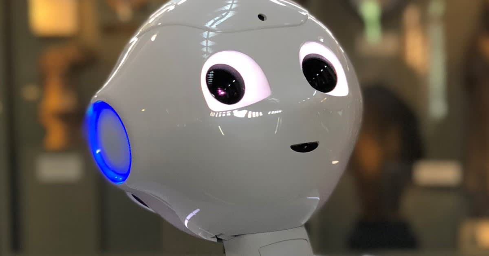
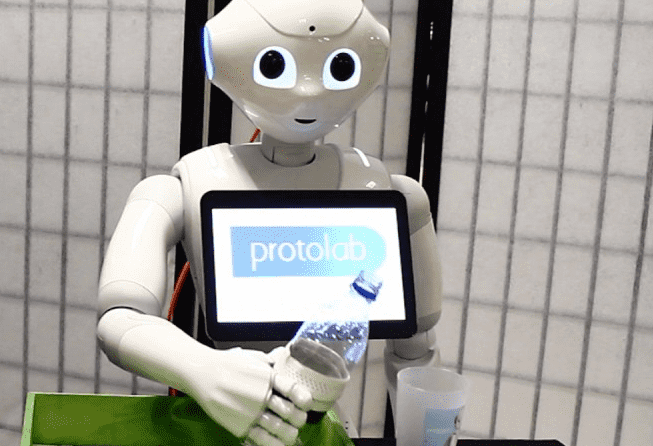
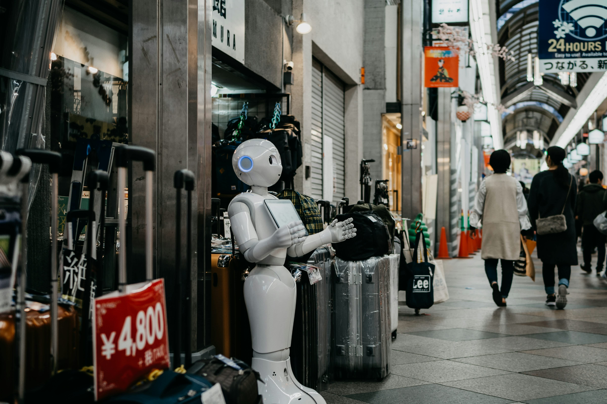
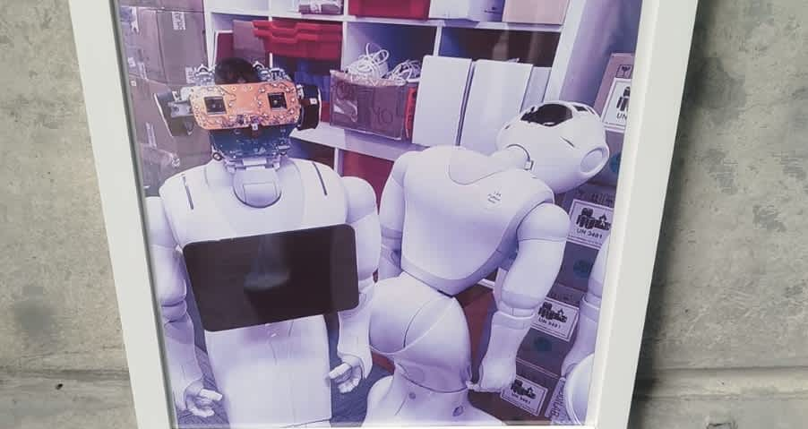

# 🤖 SinfonIA Uniandes - Wiki Oficial  

Bienvenido a la documentación de **SinfonIA Uniandes**, la iniciativa estudiantil de **robótica social** de la Universidad de los Andes.  
Trabajamos con dos robots **Pepper** para desarrollar tecnologías en interacción humano-robot y su aplicación en diversos entornos.  

## 📌 Explora la Wiki  
Haz clic en cualquier categoría para acceder a la información:  

<table>
  <tr>
    <td align="center">
      <a href="./Primeros-Pasos">
        
         <strong>Primeros Pasos</strong>
      </a>
    </td>
    <td align="center">
      <a href="./Recursos-Básicos">
        
         <strong>Recursos Básicos</strong>
      </a>
    </td>
    <td align="center">
      <a href="./🎮-Remote-Controller">
        
         <strong>Remote Controller</strong>
      </a>
    </td>
    <td align="center">
      <a href="./Documentación-Robot">
        
         <strong>Documentación del Robot</strong>
      </a>
    </td>
  </tr>
</table>

## Herramientas

<table>
  <tr>
    <td align="center">
      <a href="./Interface">
        
         <strong>Interface</strong>
      </a>
    </td>
    <td align="center">
      <a href="./Navigation">
        
         <strong>Navigation</strong>
      </a>
    </td>
    <td align="center">
      <a href="./Speech">
        
         <strong>Speech</strong>
      </a>
    </td>
    <td align="center">
      <a href="./Vision">
        
         <strong>Vision</strong>
      </a>
    </td>
  </tr>
</table>

<table align="center">
  <tr>
    <td align="center">
      <a href="./Manipulation">
        
         <strong>Manipulation</strong>
      </a>
    </td>
    <td align="center">
      <a href="./Task">
        
         <strong>Task</strong>
      </a>
    </td>
    <td align="center">
      <a href="./Toolkit">
        
         <strong>Toolkit</strong>
      </a>
    </td>
  </tr>
</table>

